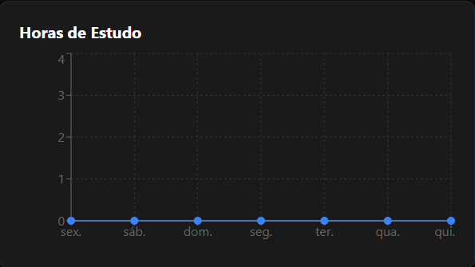
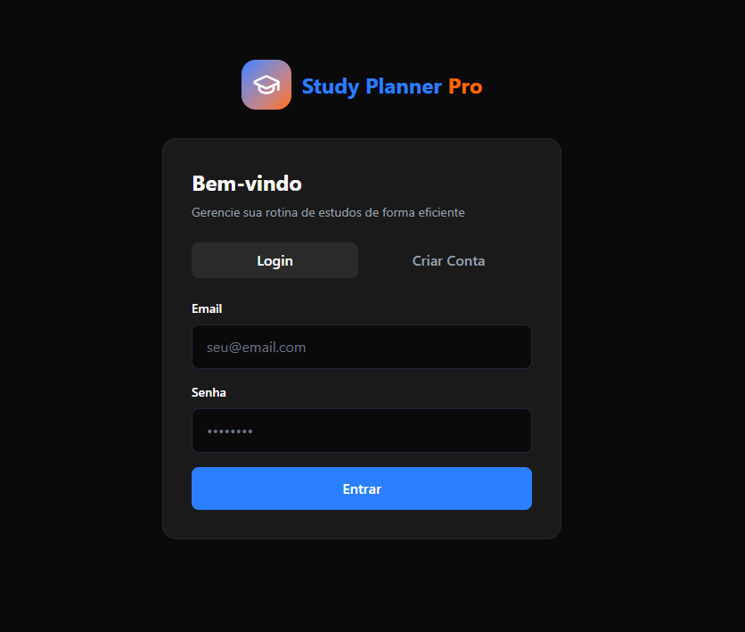
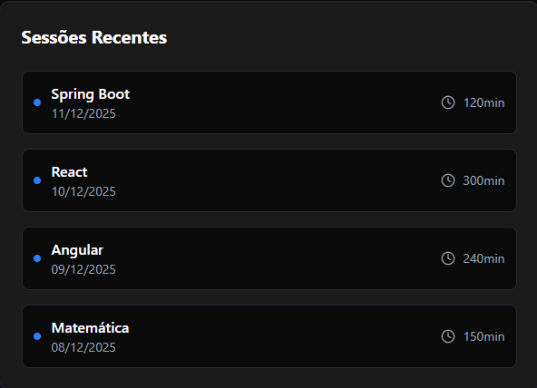
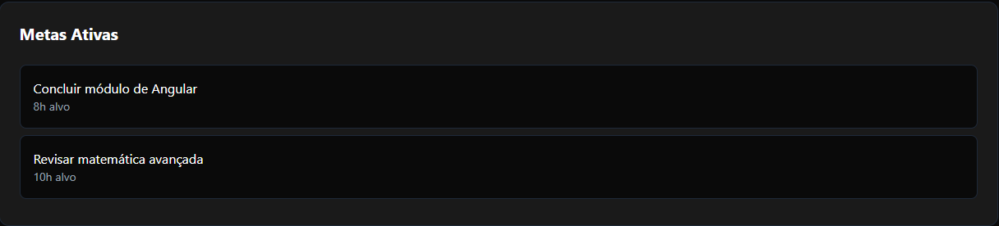

# Study Planner Pro 🚀

[](https://reactjs.org/)
[](https://www.java.com/)
[](https://spring.io/projects/spring-boot)
[](LICENSE)

A complete study-planning application with a **React + Tailwind CSS frontend** and a **Java + Spring Boot backend**.

## Project Structure


```
study-planner/
├── backend/ # REST API  in Java + Spring Boot
└── frontend/ # Interface in React + Tailwind CSS
```


## 🛠 Technologies

### Backend
- **Java 25**
- **Spring Boot 3.5**
- **Spring Web** (to create the REST API)
- **Spring Data JPA** (for database access)
- **Spring Security** (authentication & authorization)
- **H2 Database** (in-memory for development)
- **Lombok** (reduces boilerplate)
- **Maven** (dependency & build management)

### Frontend
- **React 19.2** (UI library)
- **Vite 7.2** (fast development bundler)
- **Tailwind CSS 4.1** (responsive CSS framework)
- **React Router DOM** (page navigation)
- **Axios** (API HTTP requests)
- **Recharts** (charts and statistics)
- **Lucide React** (modern icons)

## ⚡ Quick Installation

### Backend

```bash
cd backend
./mvnw spring-boot:run
# Backend available at: http://localhost:8080
```


### Frontend

```bash
cd frontend
pnpm install
pnpm dev
# Frontend available at: http://localhost:5173
```

The frontend will be available at: `http://localhost:5173`

## 🎯 Features

- ✅ **Authentication** (Login / Register)
- ✅ **Dashboard with user statistics**
- ✅ **Study-hours charts**
- ✅ **Recent study sessions**
- ✅ **Active goals with progress tracking**
- ✅ **Subject management**
- ✅ **Full REST API**
- ✅ **Responsive design**
- ✅ **Dark mode support**


*Example of the Dashboard of Study Planner Pro*


## 🔗 API Endpoints

| Functionality | Endpoint | Method |
|------------------------|------------------------------------------------|--------|
| Register user | `/api/auth/register` | POST |
| Log in | `/api/auth/login` | POST |
| User statistics | `/api/dashboard/stats/{userId}` | GET |
| List sessions | `/api/study-sessions/user/{userId}` | GET |
| List recent sessions | `/api/study-sessions/user/{userId}/recent` | GET |
| Create session | `/api/study-sessions` | POST |
| Delete session | `/api/study-sessions/{id}` | DELETE |
| List goals | `/api/goals/user/{userId}` | GET |
| Create goal | `/api/goals` | POST |
| Update goal | `/api/goals/{id}` | PUT |
| Delete goal | `/api/goals/{id}` | DELETE |
| List subjects | `/api/subjects/user/{userId}` | GET |
| Create subject | `/api/subjects` | POST |
| Delete subject | `/api/subjects/{id}` | DELETE |


## 🗄 Database

- **H2 Database** (in-memory for development)
- H2 Console: `http://localhost:8080/h2-console`
- JDBC URL: `jdbc:h2:mem:studyplanner`
- User: `sa`
- Password: *(empty)*

> To use a **persistent database** (PostgreSQL / MySQL), update your `application.properties` and set:
> ```
> spring.jpa.hibernate.ddl-auto=update
> ```

## 🤝 Contributions

1. Fork the repository
2. Create a feature branch: `feature/my-feature`
3. Commit your changes
4. Open a Pull Request


## 🚀 Next Steps

- Implement a persistent database
- Improve test coverage
- Add more statistics and charts


## 📸 Screenshots


*Main screen view of Study Planner Pro*


*List of recent study sessions*


*Tracking of active goals with progress*
